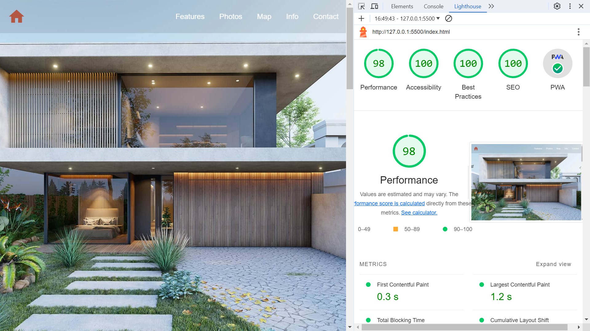

# :zap: HTML CSS Terracota

* Single page optimised HTML-CSS-JS website to market a holiday home and achieve a near-perfect lighthouse score
* **Note:** to open web links in a new window use: _ctrl+click on link_


## :page_facing_up: Table of contents

* [:zap: HTML CSS Terracota](#zap-html-css-terracota)
  * [:page\_facing\_up: Table of contents](#page_facing_up-table-of-contents)
  * [:books: General info](#books-general-info)
  * [:camera: Screenshots](#camera-screenshots)
  * [:signal\_strength: Technologies](#signal_strength-technologies)
  * [:floppy\_disk: Setup](#floppy_disk-setup)
  * [:computer: Code Examples](#computer-code-examples)
  * [:cool: Features](#cool-features)
  * [:clipboard: Status \& To-Do List](#clipboard-status--to-do-list)
  * [:clap: Inspiration](#clap-inspiration)
  * [:file\_folder: License](#file_folder-license)
  * [:envelope: Contact](#envelope-contact)

## :books: General info

* Built with HTML, CSS and JavaScript (no frameworks or libraries)
* Near-perfect performance, Perfect scores on accessibility, best practices, SEO and PWA
* CSS and Javascript are minimised to reduce initial render/First Contentful Paint time.

## :camera: Screenshots

.

## :signal_strength: Technologies

* [HyperText Markup Language HTML](https://developer.mozilla.org/en-US/docs/Glossary/HTML)
* [Cascading Style Sheets CSS](https://developer.mozilla.org/en-US/docs/Web/CSS) styling
* [JPG to WebP Converter](https://www.freeconvert.com/jpg-to-webp) to create new image formats that result in a higher Lighthouse score
* [Online CSS Minifier Tool and Compressor](https://www.toptal.com/developers/cssminifier)
* [Online JavaScript Minifier Tool and Compressor](https://www.toptal.com/developers/javascript-minifier)

## :floppy_disk: Setup

* Open index.html using [Visual Studio Live Server](https://marketplace.visualstudio.com/items?itemName=ritwickdey.LiveServer). Changes are updated automatically on server.

## :computer: Code Examples

* index.html extract showing how new format webp images are marked up in HTML

```html
      <picture>
          <source
            type="image/webp"
            width="400"
            height="266"
            srcset="assets/images/offer-1.webp"
          />
          <source
            type="image/jpeg"
            width="400"
            height="266"
            srcset="assets/images/offer-1.jpg"
          />
          
      </picture>
```

## :cool: Features

* This is a Progressive Web App (PWA) so user experience is close as possible to a downloaded app. It can run on multiple platforms, handles off-line by caching resources locally and can be downloaded as a permanent app.
* Lighthouse score nearly perfect

## :clipboard: Status & To-Do List

* Status: Working.
* To-Do: Optimise images using compress or CDN.

## :clap: Inspiration

* [Anna Monus: 9 tricks to eliminate render blocking resources](https://blog.logrocket.com/9-tricks-eliminate-render-blocking-resources/)

## :file_folder: License

* MIT

## :envelope: Contact

* Repo created by [ABateman](https://github.com/AndrewJBateman), email: `gomezbateman@yahoo.com`