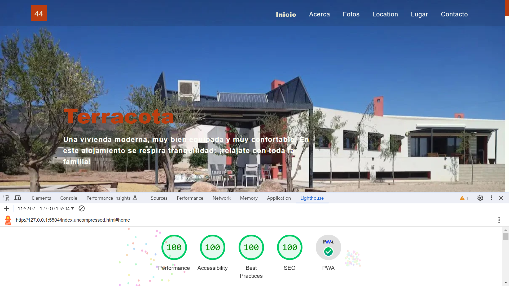

# :zap: HTML CSS Terracota

* Single page optimised HTML-CSS-JS website to market a holiday home and achieve a perfect lighthouse score
* **Note:** to open web links in a new window use: _ctrl+click on link_


## :page_facing_up: Table of contents

* [:zap: HTML CSS Terracota](#zap-html-css-terracota)
  * [:page\_facing\_up: Table of contents](#page_facing_up-table-of-contents)
  * [:books: General info](#books-general-info)
  * [:camera: Screenshots](#camera-screenshots)
  * [:signal\_strength: Technologies](#signal_strength-technologies)
  * [:floppy\_disk: Setup](#floppy_disk-setup)
  * [:computer: Code Examples](#computer-code-examples)
  * [:cool: Features](#cool-features)
  * [:clipboard: Status \& To-Do List](#clipboard-status--to-do-list)
  * [:clap: Inspiration](#clap-inspiration)
  * [:file\_folder: License](#file_folder-license)
  * [:envelope: Contact](#envelope-contact)

## :books: General info

* Built with HTML, CSS and JavaScript with Bootstrap 5 CSS and Javascript
* Progressive Web App (PWA)
* Perfect performance, Perfect scores on accessibility, best practices and SEO.
* CSS and Javascript are minimised to reduce initial render/First Contentful Paint time.

## :camera: Screenshots

.

## :signal_strength: Technologies

* [HyperText Markup Language HTML](https://developer.mozilla.org/en-US/docs/Glossary/HTML)
* [Cascading Style Sheets CSS](https://developer.mozilla.org/en-US/docs/Web/CSS) styling
* [JPG to WebP Converter](https://www.freeconvert.com/jpg-to-webp) to create new image formats that result in a higher Lighthouse score
* [PurifyCSS Online](https://purifycss.online/) - remove unused CSS code from your stylesheets
* [Online CSS Minifier Tool and Compressor](https://www.toptal.com/developers/cssminifier)
* [Online JavaScript Minifier Tool and Compressor](https://www.toptal.com/developers/javascript-minifier)
* [Boxy SVG: Online scalable graphics generator](https://boxy-svg.com/)

## :floppy_disk: Setup

* Open index.html using [Visual Studio Live Server](https://marketplace.visualstudio.com/items?itemName=ritwickdey.LiveServer). Changes are updated automatically on server.

## :computer: Code Examples

* index.html extract showing how new format webp images are marked up in HTML

```html
          <div class="carousel-item active">
            <picture>
              <source
                type="image/webp"
                class="d-block w-100"
                srcset="./images/bg/house-front.webp"
                alt="house front view"
              />
              <source
                type="image/jpeg"
                class="d-block w-100"
                srcset="/images/bg/house-front.jpg"
                alt="house front view"
              />
              
            </picture>
            <div class="carousel-caption col-md-6 col-10 col-offset-md-6">
              <h1>Terracota</h1>
              <p class="carousel-image-text">
                Una vivienda moderna, muy bien equipada y muy confortable. En
                este alojamiento se respira tranquilidad: ¡relájate con toda la
                familia!
              </p>
            </div>
          </div>
```

## :cool: Features

* Lighthouse score perfect
* This is a Progressive Web App (PWA) so user experience is close as possible to a downloaded app. It can run on multiple platforms, handles off-line by caching resources locally and can be downloaded as a permanent app.

## :clipboard: Status & To-Do List

* Status: Working.
* To-Do: Add sections. Optimise images using compress or CDN. Work out how to remove unused javascript.

## :clap: Inspiration

* [Anna Monus: 9 tricks to eliminate render blocking resources](https://blog.logrocket.com/9-tricks-eliminate-render-blocking-resources/)
* [Maddy Osman: The Ultimate List of Web-Safe HTML and CSS Fonts](https://blog.hubspot.com/website/web-safe-html-css-fonts)
* [Rohith Sasanken: Types of SEO Keywords You MUST Know in 2023](https://www.linkedin.com/pulse/types-seo-keywords-you-must-know-2023-rohith-sasanken/)
* [icolorpalette.com](https://icolorpalette.com/download/palette/136393_color_palette.jpg) combination of terracotta and olive tree leaf green.

## :file_folder: License

* This project is licensed under the MIT License - see the LICENSE file for details.

## :envelope: Contact

* Repo created by [ABateman](https://github.com/AndrewJBateman), email: `gomezbateman@yahoo.com`
